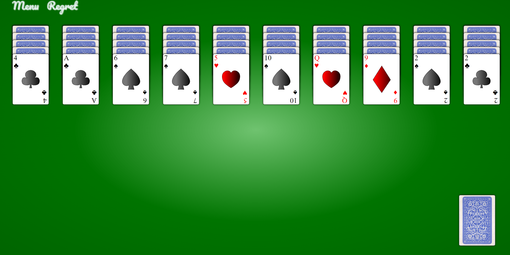

# Introduction

This project was a re-development of [VueSolitaire](https://github.com/silent-lad/VueSolitaire), 
by adding multiplayer part and a golang backend [SolitaireBackend](https://github.com/innovationb1ue/SolitaireBackend) written by me as well. 

This is a toy which I created to play with my girlfiend. You can simply set up the server and then have some competitive fun with your friend in solitaire game! 

# screen shot

# Run

Get in the dir of this repo. 

run commands below with npm installed. 

`npm install`

`npm run dev`

# Run backend

See introduction in [SolitaireBackend](https://github.com/innovationb1ue/SolitaireBackend)
